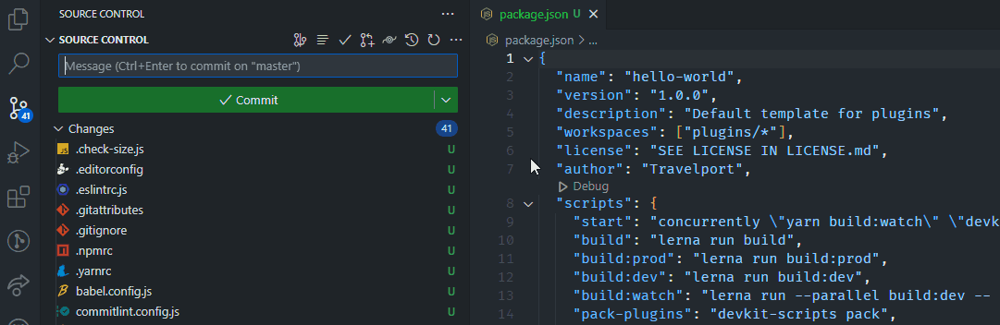
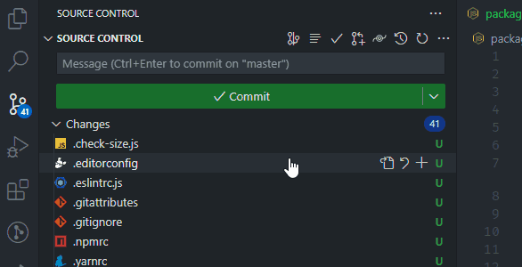

# spc-commit-prefixer README

This Visual Studio Code extension facilitates the commit process by adding a prefix for your commit messages in the projects of Smartpoint Cloud.

## Features

Button to run `Git SPC Commit Prefixer` command:

Automates the format of the commit and insert value inside the Source Control Git Message box.

## Extension Settings

This extension contributes the following settings:

- `SPC-CommitPrefixer.pluginNames`: The name of the plugins that can be choose to add to the commit message.
- `SPC-CommitPrefixer.commitPrefixes`: The prefix commit list that can be choose to add to the commit message.

## Release Notes

## [0.0.1] - 2023-14-4

### Added

- Initial release

## [0.0.2] - 2023-11-27

### Changed

- Add the possibility to write empty plugin name or select the last option "Generic update" to put empty plugin name to the commit message.
